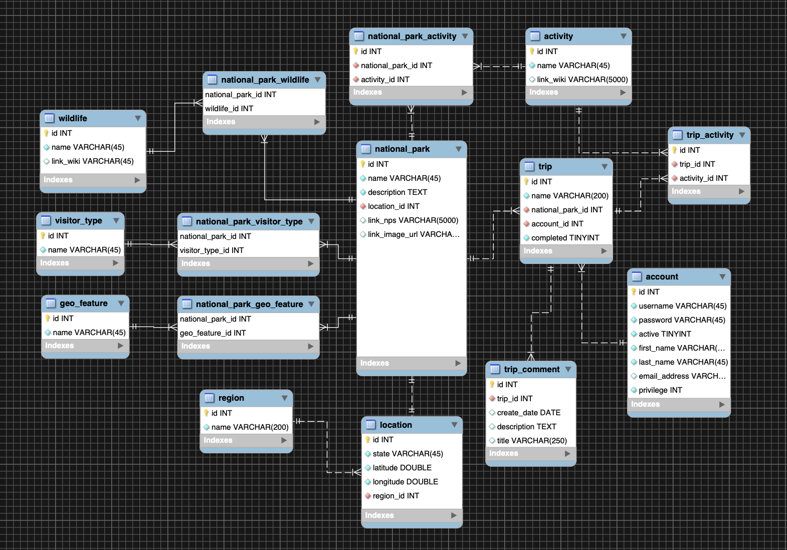

## Full Stack Group MVC Project
Week 11, Mid-term Team Project for Skill Distillery

## Adventure Planner
Team members and roles:

* Candace Lewis (Developer, Scrum Master)
* Joe Debroux (Developer, Repo Owner)
* Alicia Glassmeyer (Developer, Jill-of-all-Trades)
* Casey Asher (Developer, DBA)

### Overview
Adventure Planner is centered around the United States' National Parks and providing a user with ability to search and plan trips to parks that catch their interest.

### Description
[Hosted live on AWS ](http://18.222.90.180:8080/ChooseAdventure/)

Feel free to create an account and explore our site!

Homepage

Create Account

Park Listing

Database Structure

### Technologies and Methodologies Used
* Spring Boot, Spring MVC, Sprint Tool Suite
* MySql, MySql Workbench
* Java, JPA, JDBC
* HTML, CSS
* Git / Github
* Agile, pair-programming, whiteboarding, wire diagrams, scrums

### Lessons Learned
* The four of us were pretty excited about things during the planning phase and we made a database that reflected that excitement. The size of our database and the relations between the tables quickly became complicated to navigate successfully. Unfortunately, we had to move a few tables into the stretch goals section. Start small and build out as needed.
* Set the project up in a way that provides for an equal-ish distribution of labor. One way to do this is split the controller into a few different files, allowing more people to work on it without merge conflicts.

### Stretch Goals
* Search parks by geo-feature, wildlife, and visitor type.
* Google Maps Integration.
* Share trips via social media.
* Leave comments for trips and parks.
* Printer-friendly view.

#### Icebox
* Content for the activities, wildlife, and geo-features tables that accurately reflects the diversity of the parks.
* Predictive autocomplete in the search fields.
* Review trips and parks.
* Expansion of park scope to include more than US National Parks.
